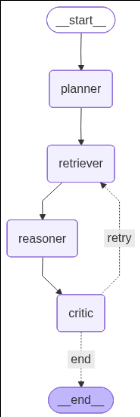

# SmartPaper AI

> Multi-Agent Multimodal Research Paper Assistant powered by RAG, LangGraph, Gemini, ChromaDB, and Fine-Tuned Phi-3.

---

## Live: ```https://huggingface.co/spaces/LINGESH-7/AI-RESEARCH-PAPER-QA```
---

## Fine Tuned model:
```
https://huggingface.co/LINGESH-7/Phi-3-mini-4k-instruct-FT-ON-QASPER/tree/main
```
---
## Overview

SmartPaper AI is an AI-powered research assistant that lets you upload academic papers and interact with them through natural language.

The system combines **Multimodal RAG**, **Agentic AI via LangGraph**, and a **Fine-Tuned LLM** to answer questions grounded directly in the uploaded paper — including methodology, results, tables, figures, architectures, contributions, and conclusions.

---

## Agent Graph
<p align="center">
  
</p>

---

## Features

| Category | Capabilities |
|---|---|
| **PDF Processing** | Text extraction, table extraction, figure/image extraction |
| **Multimodal Understanding** | Gemini Vision for figures, LLM-based table & text summarization |
| **Advanced RAG** | MultiVector Retriever, ChromaDB, semantic search, context-aware retrieval |
| **Agentic Workflow** | LangGraph-powered Retriever → Reasoner → Critic pipeline |
| **Fine-Tuned QA Model** | Phi-3 Mini 3.8B fine-tuned on QASPER via QLoRA |

---

## System Architecture

```
                     PDF Upload
                          │
                          ▼
              ┌── Document Processing ──┐
              │           │             │
              ▼           ▼             ▼
            Text        Tables        Images
              │           │             │
              ▼           ▼             ▼
         Summaries   Summaries    Gemini Vision
              │           │             │
              └─────────┬──────------───┘
                        │
                        ▼
               BGE Embeddings
                        │
                        ▼
                   ChromaDB
                        │
                        ▼
            MultiVector Retriever
                        │
                        ▼
                   LangGraph
          ┌─────────────┼─────────────┐
          ▼             ▼             ▼
      Retriever      Reasoner      Critic
          │             │             │
          └─────────────┴─────────────┘
                        │
                        ▼
                  Final Answer
```

### Agentic Workflow

```
User Query
    ↓
Retriever Agent
    ↓
Reasoning Agent
    ↓
Critic Agent
    ↓
Final Answer
```

---

## Tech Stack

### LLMs
- **Gemini 2.5 Flash** — Multimodal understanding & reasoning
- **Llama 3.1** — General-purpose reasoning
- **Phi-3 Mini 3.8B (Fine-Tuned)** — Research QA

### Frameworks & Libraries
- **LangChain** · **LangGraph** · **Flask**
- **PyMuPDF** · **Unstructured** — PDF parsing
- **Unsloth** · **PEFT** · **QLoRA** — Fine-tuning

### Vector Database & Embeddings
- **ChromaDB** — Vector store
- **BAAI/bge-base-en-v1.5** — Embeddings

---

## Project Structure

```
SmartPaper-AI/
│
├── agents/
│   ├── graph.py
│   ├── nodes.py
│   
│
├── parsers/
│   ├── pdf_parser.py
│  
│
├── embeddings/
│   ├── embedder.py
│   └── retriever.py
│
├── models/
│   ├── finetuned_reader.py
│   
│
│
├── uploads/
├── static/
├── templates/
│
├── app.py
├── config.py
├── requirements.txt
├── Dockerfile
└── README.md
```
---

## Getting Started

### 1. Clone the Repository

```bash
git clone https://github.com/Lingesh-7/SmartPaper-Ai
cd smartpaper-ai
```

### 2. Create & Activate Virtual Environment

```bash
# Create
python -m venv .venv

# Activate — Linux/Mac
source .venv/bin/activate

# Activate — Windows
.venv\Scripts\activate
```

### 3. Install Dependencies

```bash
pip install -r requirements.txt
```

### 4. Set Environment Variables

Create a `.env` file in the root directory:

```env
GOOGLE_API_KEY=your_google_api_key
GROQ_API_KEY=your_groq_api_key
```

### 5. Run the Application

```bash
python app.py
```

Visit `http://localhost:5000` in your browser.

---

## Example Queries

**Figure Understanding**
```
Explain Figure 3.
What trend is shown in Figure 5?
```

**Table Understanding**
```
Summarize Table 2.
Compare the results shown in Table 4.
```

**Research Understanding**
```
What is the main contribution of this paper?
Why did the authors choose RAG instead of BART?
Explain the proposed architecture.
```

---

## Fine-Tuning Pipeline

```
QASPER Dataset
      ↓
  Formatting
      ↓
    QLoRA
      ↓
Phi-3 Mini Fine-Tuning (Unsloth)
      ↓
Research QA Model
```

| Parameter | Value |
|---|---|
| **Base Model** | `microsoft/Phi-3-mini-4k-instruct` |
| **Dataset** | `allenai/qasper` |
| **Method** | QLoRA |
| **Framework** | Unsloth + PEFT |


---

## License

MIT License — This project is intended for research and educational purposes.
